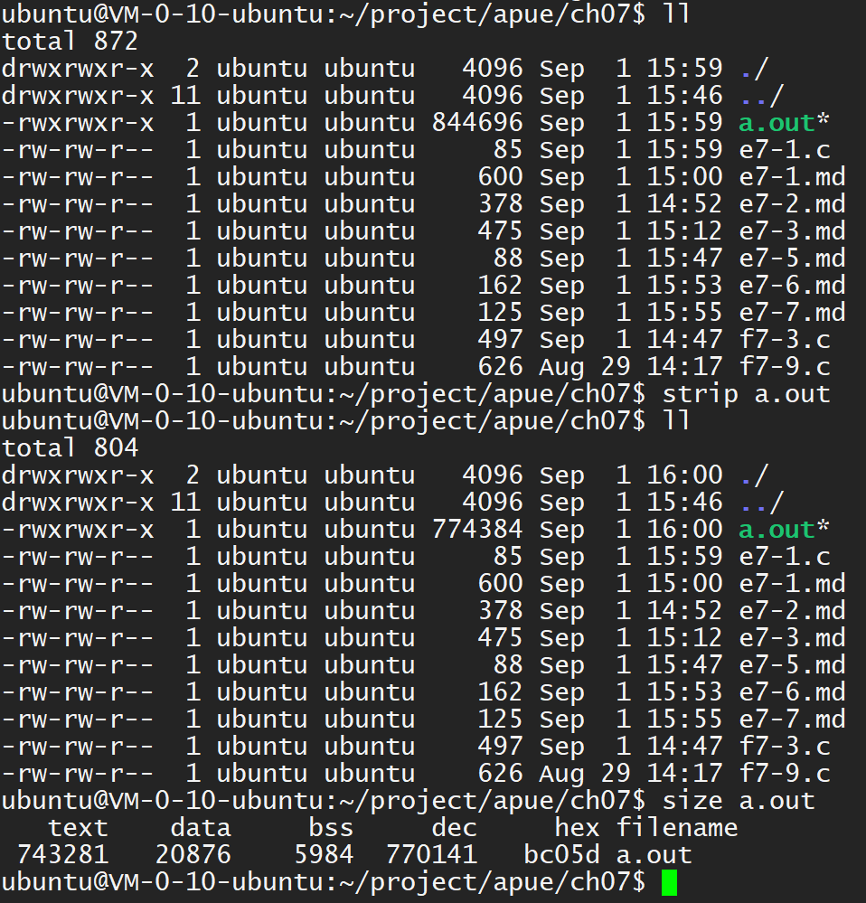

The excutable file (a.out) contains symbol table information that can be helpful
in debugging a `core` file. To remove this information, use the `strip` command.
Stripping the two `a.out` files reduces their size to 798760 and 6200 bytes.

------

After stripping, the `a.out` file size is still larger than the sum of text and
data segment as shown: 
I think the reason is, there are still some information such as program environ
in the `a.out`.

